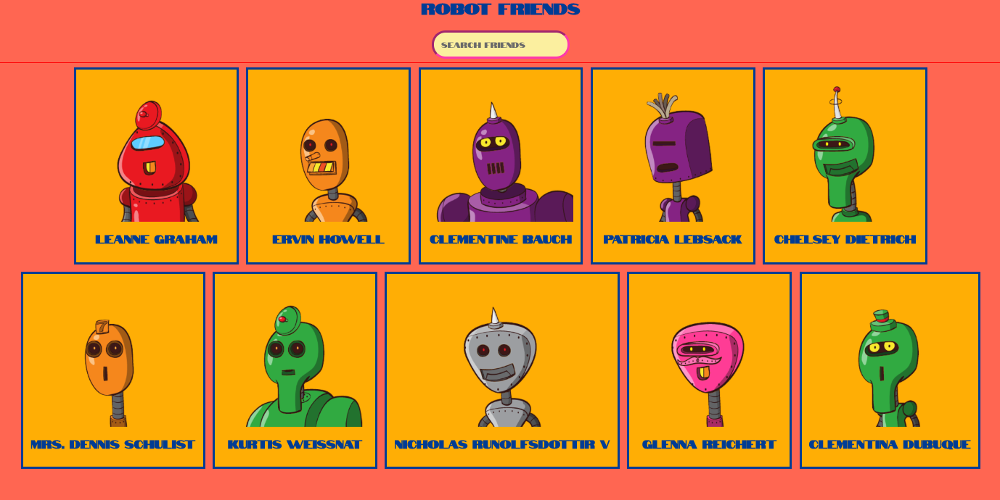
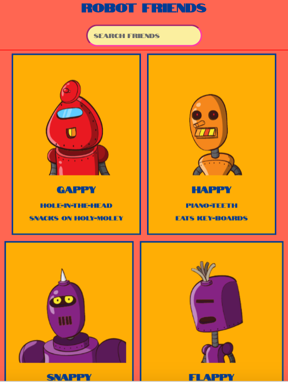

# Robot Friends
Robot Friends is a student project in React.js using 2 APIs [https://jsonplaceholder.typicode.com/users] and [https://robohash.org]. It is adapted from Andrei Neagoie's The complete Web Developer 2019: Zero to Mastery (Udemy Tutorial)



## Table of Contents

- Learning objectives
- Project setup(scaffolding)
- Tasks 1-6 cover in detail the tutorials in Section 19 upto video 206
- Redux to be added later videos 206-218

### Learning objectives

Robot Friends is a project that I was worked on just after graduating from GA and just before I got my internship at goodlord. I wanted to build an app purely on the front end to revise basic concepts of React and build the project assisted by the video-tutorials. It records each task in this read-me to embed knowledge and improve skills. This read-me therefore is weighted towards task-based descriptions.

### Project set up and scaffolding Section 19

- Notes from Videos 191-194
React is a library that enables a quick rendering of front-end components and DOM manipulation. It is good for VR, Desktop and Mobile apps as it is follows the MVC (model view control) principle. The concept of small, reusable modules makes it easy to configure SPAs (Single Page Applications) and scale them.

Data flow in  React is downstream. This results in a more efficient and more bug-free front-end. React also makes DOM manipulation easy as it creates a copy of the DOM, the virtual DOM which renders the app. Once again, this results in a more efficient app as frequent DOM interaction (as with jQuery, vanilla js) is labour intensive and more prone to code errors.

- Set up the project with npm
- global install in terminal] [npm - g install create-react-app]
- create a react project folder [npm create-react-app <projectname>]
- React scripts packages all the webpack/ babel transpiling in the background - check package json for dependencies installed.
- Version of the package is locked in to the package-lock json
- git-ignore - ignores the git and node files when pushed to project
- React src files - app.js and index.js helps create the single page app
- index.css - the main css
- index.html - the root file for the app to render

### Task 1 (Video 191-196) Set up first component, front-end data, API for image source

Set up file structure with a front end source folder. 

1. Create a functional component for the first card - card.js - ```const Card = () => {return(<div></div>)} export default Card;```
  Consider using semantic jsx with the fragment tag [http://blog.jmes.tech/react-fragment-and-semantic-html/] - the task asks you to create a div with some h2 text and the image tag src to link as a string to an ApI [https://robohash.org]

2. To style the component install the Tachyons library into the project in the index.js file. Documentation for Tachyons [http://tachyons.io/docs/]

3. For the data create a data-file with an array of objects - create a component called robots.js, the properties of the object can be imported in and rendered as properties of the jsx element (props). The properties I created are name, description and fave food and the id.

4. Rendering props - import the file ```import { robots } from './robots';``` in ```app.js```. The file is wrapped in curly braces as it is javascript calling the data stored in the variable called robots. The h2 tag now can be changed to render props ```<h2>{props.name}</h2>``` this will now render the names of the robot.

5. Using template literals use them for the source of the image which now are a prop - so it requires the back ticks, the dollar sign and curly braces for the property id ```{`https://robohash.org/${id}?100x100`}```

6. Destructure the props by passing them as params

- initial set up for destructuring

```
	const Card = ({ props }) => {
     const Card = ({ name, description, favefood, id })
	return (<div></div>)}        
```
- props destructured

```const Card = ({ name, description, favefood, id }) ```

This is how the card component should look like by the end of this video

```
import React from 'react';
const Card = ({ name, description, favefood, id }) => {
	return (
		<div className="bg-gold dib br-pill pa3 ma2 grow bg-animate transition: background-color .15s ease-in-out tc ba bw2 shadow-6">
			<div>
				
			</div>

			<div>
				<h2>{name}</h2>
				<p>{description}</p>
				<p>{favefood}</p>
			</div>
		</div>
	);
};
export default Card;

```
### Task 2 (Video 198) Create parent of card component, map data into the child component using array methods

1. Create a CardList component as a functional component.This component, imports the Card Component,  returns the index of the robots array that has been created in the robots.js file and saved in a constant and exported to this file as a deconstructed prop from the parent - app.js. 

The CardList now becomes the parent of the Card Component and needs to be imported into the Card Component.

```const CardList =() => {return(<div><h2>robots[0].name</h2>/div>)}```

2. To dynamically render the robots as 10 robots each in a Card Component, we can use the map method to render all the robots in the array.

3. The Card List Component should look like this by the end of the video - here we access the index of the array ```[i]``` and when we use it in a jsx tag like the key tag on its own use curly braces ```{i}```

```
import React from 'react';
import Card from './card.js';

const CardList = ({ robots }) => {
	return (
		<div>
			{robots.map((user, i) => {
				return (
					<Card
						key={i}
						id={robots[i].id}
						name={robots[i].name}
						favefood={robots[i].favefood}
						description={robots[i].description}
					/>
				);
			})}
		</div>
	);
};

export default CardList;

```
This is how the app looks with the data hard-coded, each of the props has its own name, if you want get more data from the API call, the only property that matches the API is name - therefore the properties favefood, description will not render as they do not exist as props in the API. Change the props here if you want to render more data using the name-value pairs in the API.



### Task 3 (Video 199) Set up App.js as stateful component, custom functions to pass as props to a search component

We now create the parent component - app.js where data trickles down to all the child components. As data flow is top to bottom, App.js is the component that holds state and all properties are passed from state to the child components. The robots array is therefore passed from App.js to all the other child components in the app as props ```{robots}``` as we have seen.

1. Create a search box as a dumb component search.js at the beginning of the video the component looks like this:-

```
import React from 'react';

const SearchBox = () => {
	return (
		<div className="pa2">
			<input
				className="pa3  b--hot-pink bw2 br-pill bg-light-yellow"
				type="search"
				placeholder="search friends"
				onChange={}
			/>
		</div>
	);
};
export default SearchBox;

```

2. Since state will be held in the app.js component, for the searchbox to render functionality in the search input, it will need props to be passed down from app.js into the component to handle the change event - in this case the user typing a search request - and it will need to filter the items that are requested and send back the filtered items to the user. 

The search functionality will need a custom function to be written in the app.js component and handed down as a prop to the child component - the searchbox.

The search component as a functional component, is stateless and renders whatever is changed in state (in app.js) because the prop is handed down.

```
import React from 'react';

const SearchBox = ({ }) => {
	return (
		<div className="pa2">
			<input
				className="pa3  b--hot-pink bw2 br-pill bg-light-yellow"
				type="search"
				placeholder="search friends"
				onChange={}
			/>
		</div>
	);
};
export default SearchBox;

```

By the end of the video the props of ```{searchfield}``` and ```{searchChange}``` will be handed down from app.js to the searchbox.js component.

3. Creating the stateful parent App.js - classes and constructors were only added to JavaScript as it became a back-end language and is influenced by Java. A class is a type of object that with a constructor creates a blue-print that can be replicated.

```

class App extends Component {
	constructor() {
		super();
		this.state = {
			robots: robots,
			searchfield: ''
		};
	}

```  

Stateful components use this method with the super method to render the jsx elements that need to be influenced by state. The jsx elements now need to use lexical ```this``` to render the jsx elements where ```this``` is the object that the SearchBox and CardList refer to which is state.

```
            <div className="tc bg dark-blue bg-light-red">
				<h1>Robot Friends</h1>
				<SearchBox searchChange={this.onSearchChange} />
				<CardList robots={this.state.robots} />
			</div>
```

Once the blue print is created, the methods in state can be handed down to child components as props. The custom-function ```onSearchChange``` for example, will handle the change that the user inputs into the search bar. The event - updating the input field will have a value that changes. State which is immutable has to be changed and therefore the ```setState method``` is called, this updates the empty value of the input to the value that the user types in the search field. Searchfield's original state is empty - therefore that is what is represented by the constructor and robots (the data from the robots array) represents the imported robots object and the data in this object.

```
	onSearchChange = (event) => {
		// console.log(event.target.value);
		this.setState({ searchfield: event.target.value });
	};
 ```
 Check the function works with a console log and with react dev tools

The filtering of the data of robots to match the user input requires it's own custom function. This is written inside the render method. This is because the data is taken from the input and the output - rendering of the component - is reliant on the render method of react.

```
	render() {
		const filteredRobots = this.state.robots.filter((robots) => {
			return robots.name.toLowerCase().includes(this.state.searchfield.toLowerCase());
		});
		// console.log(filteredRobots);
  ```      
 Check the function works with a console log and with react dev tools then you can pass the function to the jsx element as a prop. ```<CardList robots={filteredRobots.robots} />```

 At the end of this task app.js should look like this

 ```

class App extends Component {
	constructor() {
		super();
		this.state = {
			robots: robots,
			searchfield: ''
		};
	}

	onSearchChange = (event) => {
		this.setState({ searchfield: event.target.value });
	};

	render() {
		const filteredRobots = this.state.robots.filter((robots) => {
			return robots.name.toLowerCase().includes(this.state.searchfield.toLowerCase());
		});
		return (
			<div className="tc bg dark-blue bg-light-red">
				<h1>Robot Friends</h1>
				<SearchBox searchChange={this.onSearchChange} />
				<CardList robots={filteredRobots} />
			</div>
		);
	}
}
export default App;

```
The search component does not change as much as it only receives the props passed down from app.js

```import React from 'react';

const SearchBox = ({ searchfield, searchChange }) => {
	return (
		<div className="pa2">
			<input
				className="pa3  b--hot-pink bw2 br-pill bg-light-yellow"
				type="search"
				placeholder="search friends"
				onChange={searchChange}
			/>
		</div>
	);
};
export default SearchBox;
```
### Task 4 (Video 201) Use Lifecycle Hooks, set state with an API for users, add loading div

1. There are three life cycle hooks in React - Mounting, Updating and Unmounting
- Mounting - when a component mounts, we are replacing the html root div with our index.js file.
Mounting is the start of the lifecycle hook in React - the whole app renders. The methods in this stage are classes with the  ```constructor()``` method and super to call the ```render()``` method and then we check if the app rendered with the  ```componentDidMount()``` the method - this method runs after the render method. If we use a console.log(1,2,3) when we update we can see how the virtual DOM parsed and in what sequence. We will see the lifecycle methods in action this way.

Note ```componentWillMount()``` has been deprecated as unsafe

In the App.js file we add the ```componentDidMount``` method to set state to ```this.setState({robots:robots})``` if we were using the front end data and we would show robots in the constructor method as an empty array ```constructor(){super() this.state= {robots:[]}}``` the initial state would be no robots and the update of the initial state would be to call the robots from the array in the component robots.js

```
class App extends Component {
	constructor() {
		super();
		this.state = {
			robots: [],
			searchfield: ''
		};
		// console.log('constructor-1');
	}

	componentDidMount() {
		this.setState({ robots: robots });
		// console.log('componentDidMount-2');
	}
```
- Using an API in a lifecycle method [jsonplaceholder.typicode/users] and promise-based call-back functions with the global ```fetch()``` method, if you set state to an empty object you will see that the data is not fetched and set in state the page renders an empty div, we use this empty div later to add a loading message

```
	componentDidMount() {
		// console.log('componentDidMount-2'); 
		fetch('https://jsonplaceholder.typicode.com/users')
			.then((response) => response.json())
			.then((users) => this.setState({ robots: users }));
		// .then((users) => this.setState({}));
	}
```	

2. The loading bar is good ui-ux because promise-based calls and async JavaScript means images can take longer to load and while the user is waiting instead of seeing a blank screen sees the loading message or a loading css div with conditional rendering.

```
render() {
		const filteredRobots = this.state.robots.filter((robots) => {
			return robots.name.toLowerCase().includes(this.state.searchfield.toLowerCase());
		});
		// console.log('render-3');

		if (this.state.robots.length === 0) {
			return (
				<div>
					<h2>Please wait this page is still loading</h2>
				</div>
			);
		} else
			return (
				<div className="tc bg dark-blue bg-light-red">
					<h1>Robot Friends</h1>
					<SearchBox searchChange={this.onSearchChange} />
					<ScrollyBar>
						<CardList robots={filteredRobots} />
					</ScrollyBar>
				</div>
			);
	}
}
export default App;
```
This can be refactored - the first part of this statement in JavaScript is false - becuase it is zero
```	if (this.state.robots.length === 0)``` we can change this to not false and shorten the run time of this code ```(!this.state.robots.length)``` and the if else can be changed to a ternary operator


```
return !robots.length ? (
			<div>
				<h2>Please wait this page is still loading</h2>
			</div>
		) : (
			<div className="tc bg dark-blue bg-light-red">
				<h1>Robot Friends</h1>
				<SearchBox searchChange={this.onSearchChange} />
				<ScrollyBar>
					<CardList robots={filteredRobots} />
				</ScrollyBar>
			</div>
		);
	}
}
```
### Task 5 (Video 202) Create a Scrolly Bar

1. Create another functional component and export it into App.js, When you console log props note that props has children ```props.children``` 

```
const ScrollyBar = (props) =>{
	// console.log(props) 
	return(
		<div>{props.children}</div>
	)
}

```
2. Wrap the card component with the scrollybar component, import the component into App.js

```
			<ScrollyBar>
					<CardList robots={filteredRobots} />
				</ScrollyBar>
```

Use css in jsx to style the scrolly bar, rather than styling it in css files, by the end of the video the scrollybar component should look like  this

```
import React from 'react';

const ScrollyBar = (props) => {
	return <div style={{ overflowY: 'scroll', border: '1px solid red', height: '1000px' }}>{props.children}</div>;
};

export default ScrollyBar;

```

by the end of this video the App.js file should look like this

```
import React, { Component } from 'react';
import CardList from './app-pages/cardlist';
import SearchBox from './common/searchbox';
import ScrollyBar from './common/scroll';
import './index.css';

class App extends Component {
	constructor() {
		super();
		this.state = {
			robots: [],
			searchfield: ''
		};
	}

	componentDidMount() {
		console.log('componentDidMount-2');
		fetch('https://jsonplaceholder.typicode.com/users')
			.then((response) => response.json())
			.then((users) => this.setState({ robots: users }));
		// .then((users) => this.setState({}));
	}

	onSearchChange = (event) => {
		this.setState({ searchfield: event.target.value });
	};

	render() {
		const filteredRobots = this.state.robots.filter((robots) => {
			return robots.name.toLowerCase().includes(this.state.searchfield.toLowerCase());
		});
		if (this.state.robots.length === 0) {
			return (
				<div>
					<h2>Please wait this page is still loading</h2>
				</div>
			);
		} else
			return (
				<div className="tc bg dark-blue bg-light-red">
					<h1>Robot Friends</h1>
					<SearchBox searchChange={this.onSearchChange} />
					<ScrollyBar>
						<CardList robots={filteredRobots} />
					</ScrollyBar>
				</div>
			);
	}
}
export default App;

```

The scrollybar component should look like this

```
import React from 'react';

const ScrollyBar = (props) => {
	return <div style={{ overflowY: 'scroll', border: '2px solid red', height: '800px' }}>{props.children}</div>;
};

export default ScrollyBar;
```

### Task 6 (Video 206) Use the Error Boundary Component for development

To help you in the development process use the Error Boundary component to catch errors in the console. Create a stateful component that has a new lifecycle method ```componentDidCatch()```

```
import React, { Component } from 'react';

class ErrorBoundary extends Component {
	constructor(props) {
		super(props);
		this.state = {
			hasError: false
		};
	}

	componentDidCatch(error, info) {
		this.setState({ hasError: true });
	}
	render() {
		if (this.state.hasError) {
			return <h3>Please check you have an error!</h3>;
		}
		return this.props.children;
	}
}
export default ErrorBoundary;
```

import it into App.js/ In the cardList component check that it works.

```
import React, { Component } from 'react';
import CardList from './app-pages/cardlist';
import SearchBox from './common/searchbox';
import ScrollyBar from './common/scroll';
import ErrorBoundary from './errorboundary';
import './index.css';

class App extends Component {
	constructor() {
		super();
		this.state = {
			robots: [],
			searchfield: ''
		};
	}

	componentDidMount() {
		fetch('https://jsonplaceholder.typicode.com/users')
			.then((response) => response.json())
			.then((users) => this.setState({ robots: users }));
		// .then((users) => this.setState({}));
		// do not remove checks the loading message works
	}

	onSearchChange = (event) => {
		this.setState({ searchfield: event.target.value });
	};

	render() {
		const { robots, searchfield } = this.state;
		const filteredRobots = robots.filter((robots) => {
			return robots.name.toLowerCase().includes(searchfield.toLowerCase());
		});

		return !robots.length ? (
			<div>
				<h2>Please wait this page is still loading</h2>
			</div>
		) : (
			<div className="tc bg dark-blue bg-light-red">
				<h1>Robot Friends</h1>
				<SearchBox searchChange={this.onSearchChange} />
				<ScrollyBar>
					<ErrorBoundary>
						<CardList robots={filteredRobots} />
					</ErrorBoundary>
				</ScrollyBar>
			</div>
		);
	}
}
export default App;
```

Import it into the component that you want to catch the error - the code has been commented out as this works only when the app is in production. 

```
import React from 'react';
import Card from './card.js';

const CardList = ({ robots }) => {
	// if (true) {
	// 	throw new Error('An Error Has Occured Check your Code!');
	// }
	// UNCOMMENT CODE FOR PRODUCTION
	return (
		<div>
			{robots.map((user, i) => {
				return (
					<Card
						key={i}
						id={robots[i].id}
						name={robots[i].name}
						favefood={robots[i].favefood}
						description={robots[i].description}
					/>
				);
			})}
		</div>
	);
};

export default CardList;

```